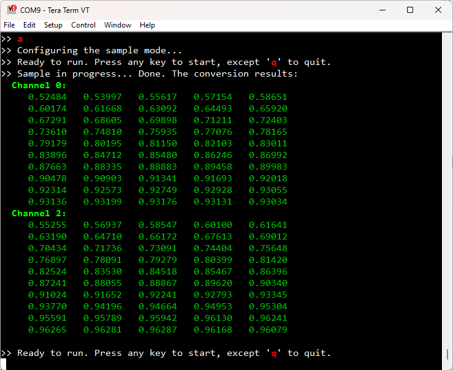

# NXP Application Code Hub

## i.MX RT1170 + NAFE13388 drivers and demos

This example demonstrates how to use NAFE13388 and i.MXRT1170 to sample analog signals. The results are either shown in a a serial terminal window or in waveforms by using the FreeMASTER Run-Time Debugging Tool.

There're two demo projects within this example repository:
- **boards/evkmimxrt1170/nafe_demos/nafe13388_terminal_demo** makes use of serial terminal as the user interface. When the demo runs, it prints a menu to let the user select an ADC sample mode. After the conversions are done, the conversion results are printed in the terminal window.
- **boards/evkmimxrt1170/nafe_demos/nafe13388_waveform_demo** makes use of the NXP FreeMASTER debugging tool. An ADC sample mode is compiled in the code, when the demo runs, the conversion results waveforms are shown in the FreeMASTER window.

#### Boards: MIMXRT1170-EVK, MIMXRT1170-EVKB
#### Categories: Industrial
#### Peripherals: DMA, GPIO, SPI, UART
#### Toolchains: IAR

## Table of Contents
1. [Software](#step1)
2. [Hardware](#step2)
3. [Setup](#step3)
4. [Results](#step4)
5. [FAQs](#step5)
6. [Support](#step6)
7. [Release Notes](#step7)

## 1. Software
This demo is built based on NXP MCUXpresso SDK. All required source files to run the demo are contained in this repository.
- MCUXpresso SDK: 2.9.1
- FreeMASTER Communication Driver: 3.0.3
- FreeMASTER App: 3.2
- IAR Embedded Workbench for ARM: 9.40.2

## 2. Hardware
- [MIMXRT1170-EVK Rev A/B/C, or MIMXRT1170-EVKB Rev A/B/C boards](https://www.nxp.com/design/development-boards/i-mx-evaluation-and-development-boards/i-mx-rt1170-evaluation-kit:MIMXRT1170-EVK)

    

- [NAFExx388-EVB](https://www.nxp.com/design/development-boards/analog-toolbox/nafexx388-evb-8-channels-universal-input-afe-evaluation-board:NAFExx388-EVB)

    

- Power sources of +15V, -15V, and 3.3V
- A signal generator
- Some jump wires
- A micro USB cable

## 3. Setup
### 3.1 Hardware Setup
1.  Connects MIMXRT1170-EVK/EVKB and NAFExx388-EVB with some jump wires:

    |    MIMXRT1170-EVK      |   NAFExx388-EVB   |
    | -- | -- |
    |  GPIO3 Pin13 - J9-16   |  SYNC   -  J79-4  |
    |  GPIO3 Pin6  - J10-2   |  DRDYB  -  J78-8  |
    |  LPSPI1 CS   - J10-6   |  CSB    -  J79-6  |
    |  LPSPI1 SDO  - J10-8   |  MOSI   -  J78-4  |
    |  LPSPI1 SDI  - J10-10  |  MISO   -  J78-6  |
    |  LPSPI1 CLK  - J10-12  |  SCK    -  J78-2  |
    |  GND         - J10-14  |  GND    -  J1-2&3 |

2.  Apply power supplies to the banana jack connectors of NAFExx388-EVB:
    - AVDD/DVDD = 3.75V to J9
    - HVDD = +15.4V to J10
    - HVSS = -15.4V to J11
    and turn on the power supply. ~0.4V additional supply to J9, J10 and J11 are
    to account for the voltage drop across Schottky diode.
3.  Provide two differential signals to the NAFExx388-EVB analog inputs with the signal
    generator, such as sine signals:
    - Signal 1 positive to J83 AI1+
    - Signal 1 negative to J83 AI1-
    - Signal 2 positive to J83 AI2+
    - Signal 2 negative to J83 AI2-
4.  Connect a USB cable between the host PC and the SDA USB port on the MIMXRT1170-EVK.

    The below figure shows the hardware set.

    

### 3.2 Software Tools and Demo Projects Setup
1.  Open and build one of the project:
    `boards/evkmimxrt1170/nafe_demos/nafe13388_terminal_demo/cm7/iar/nafe13388_terminal_demo_cm7.eww`, or
    `boards/evkmimxrt1170/nafe_demos/nafe13388_waveform_demo/cm7/iar/nafe13388_waveform_demo_cm7.eww`.
2.  To run the terminal demo, open a serial terminal tool with the following settings:
    - 115200 baud rate
    - 8 data bits
    - No parity
    - One stop bit
    - No flow control
3.  To run the waveform demo, open the FreeMASTER project:
    `boards/evkmimxrt1170/nafe_demos/nafe13388_waveform_demo/cm7/nafe13388_waveform_demo.pmpx`.
    (*NOTE: Make sure the IAR projects has been built. Otherwise, the FreeMASTER cannot find the variable symbols.*)
    - Click on the **Project->Option** menu to open the option window.
    - Select the right serial port of the MIMXRT1170-EVK SDA. Set the baud rate to 115200.
    - Select the right MAP/Symbol file generated by the IAR project `./iar/debug/nafe13388_waveform_demo_cm7.out` (default) or `./iar/flexspi_nor_debug/nafe13388_waveform_demo_cm7.out`.
    - *Note: Make sure to run the FreeMASTER project after the demo code has run.*
4.  Download one of the program to RT1170.
5.  Launch the debugger in the IDE to begin running the demo.

## 4. Results
### 4.1 The Terminal Demo
1. When the terminal demo runs, a menu is printed to let the user select a sample mode, as shown in the below figure. Type in a index number to select a sample mode to demonstrate.

    

2. After the conversions are completed, the conversion results are printed in the terminal window. Below are two examples.

    **SCSR Block** sample mode (one channel, 50 samples):

    

    **MCCR DMA** sample mode (two channels, 50 samples each):

    
3. In a sample mode configuration status, press any key can trigger new samples again, except the **q**/**Q** key to quit the current sample mode. And the modes menu is shown again to let the user select a new sample mode.
4. More sample configuration options are compiled in the code. See `boards/evkmimxrt1170/nafe_demos/nafe13388_terminal_demo/cm7/nafe13388_terminal_demo.c` for more information.

### 4.2 The Waveform Demo
1. There're two viewers in the demo FreeMASTER project.

    - The "RealTimeResults" **Oscilloscope Viewer** is used to show Non-continuous modes (SCSR, MCMR) real time results (only one sample at a time).

        

    - The "ArrayResults" **Array Viewer** is used to show array results for all sample modes (multiple samples in the array), which has poorer real time capability.

        
2. The sample mode is defined by the macro `DEMO_SAMPLE_MODE` in `boards/evkmimxrt1170/nafe_demos/nafe13388_waveform_demo/cm7/nafe13388_waveform_demo.c`. More other sample configuration options are also defined in this source file.

## 5. FAQs

## 6. Support
If you have questions, please create a ticket in [NXP Community](https://community.nxp.com/).

#### Project Metadata
<!----- Boards ----->
 

<!----- Categories ----->

<!----- Peripherals ----->
   

<!----- Toolchains ----->

Questions regarding the content/correctness of this example can be entered as Issues within this GitHub repository.

>**Warning**: For more general technical questions regarding NXP Microcontrollers and the difference in expected functionality, enter your questions on the [NXP Community Forum](https://community.nxp.com/)

## 7. Release Notes
| Version | Description / Update                           | Date                        |
|:-------:|------------------------------------------------|----------------------------:|
| 1.0     | Initial release on Application Code Hub        | October 20th 2023 |

